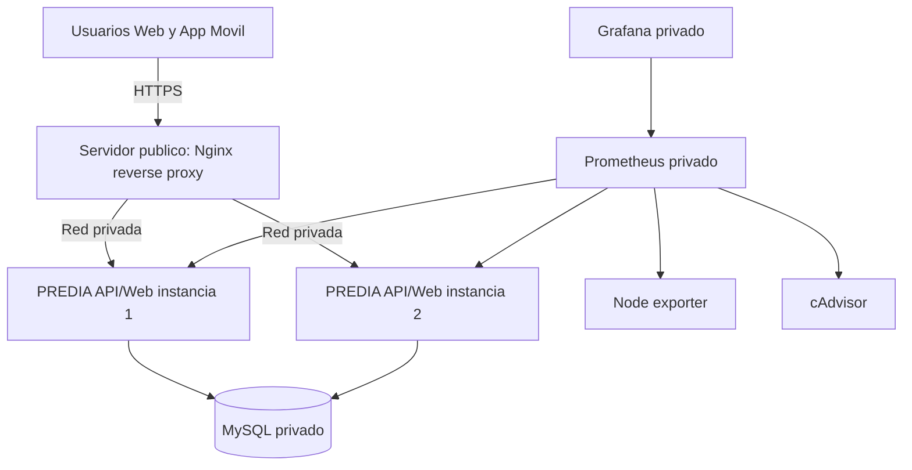

# Arquitectura de infraestructura PREDIA

## Arquitectura objetivo

## Componentes

| Componente | Exposicion | Archivo |
|---|---|---|
| Reverse proxy Nginx | Publico 80/443 | `infra/reverse-proxy/` |
| API/Web Next.js | Privado `expose: 3000` | `Dockerfile` |
| MySQL | Privado, sin puerto publico | `docker-compose.production.yml` |
| Prometheus/Grafana | Localhost o VPN | `monitoring/` |

## Desarrollo local

- `docker-compose.yml` mantiene el flujo de desarrollo.
- `docker-compose.rubric.yml` demuestra balanceo HTTP local en `8088`.
- `docker-compose.production.yml` prepara HTTPS, redes privadas y monitoreo.

## Health checks

- App: `/api/health`.
- Readiness DB: `/api/ready`.
- Metricas: `/api/metrics`.

