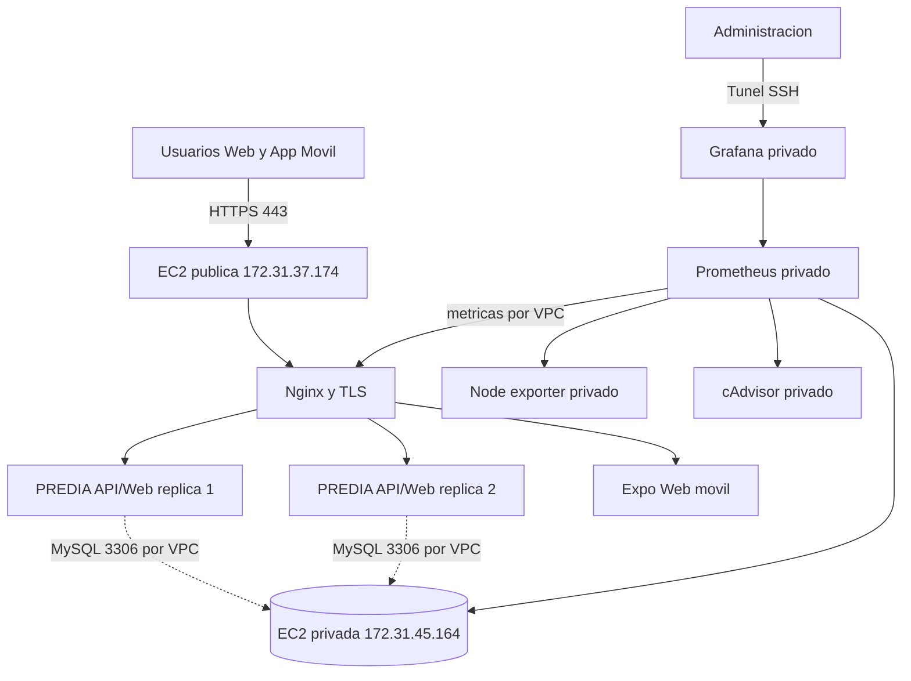

# Arquitectura de infraestructura PREDIA

## Arquitectura desplegada

## Componentes

| Componente | Exposicion | Archivo |
|---|---|---|
| Reverse proxy, API/Web y movil | EC2 publica; Nginx en 80/443 | `docker-compose.production.yml` |
| MySQL | EC2 privada; 3306 solo desde `172.31.37.174/32` | `docker-compose.private.yml` |
| Prometheus/Grafana | EC2 privada; puertos ligados a `127.0.0.1` | `docker-compose.private.yml` |
| Firewall privado | UFW y cadena `DOCKER-USER` | `infra/firewall/apply-private-ufw.sh` |

La EC2 privada no publica HTTP, HTTPS, MySQL, Grafana ni Prometheus hacia Internet. SSH usa exclusivamente llave publica y una lista de origenes permitidos. Grafana se consulta mediante un tunel SSH local.

## Desarrollo local

- `docker-compose.yml` mantiene el flujo de desarrollo.
- `docker-compose.rubric.yml` demuestra balanceo HTTP local en `8088`.
- `docker-compose.production.yml` prepara HTTPS, redes privadas y monitoreo.
- `docker-compose.private.yml` despliega la capa de datos y observabilidad en la segunda EC2.

## Health checks

- App: `/api/health`.
- Readiness DB: `/api/ready`.
- Metricas: `/api/metrics`.
