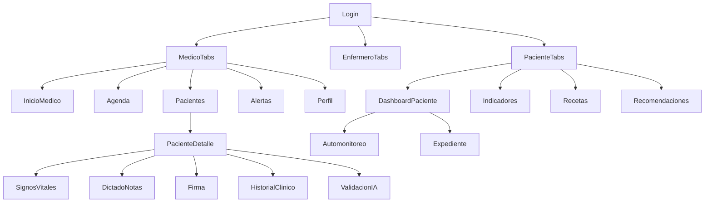

# Navegacion movil PREDIA

## Mapa



## Proteccion de rutas

- `useAuthStore` conserva sesion.
- SecureStore en nativo; localStorage solo Expo Web.
- Sesion inactiva expira localmente.
- Refresh token renueva access token ante 401.

## QA

Runners disponibles:

```bash
node scripts/mobile-cdp-qa.js
node scripts/mobile-next-sprint-qa.js
```

