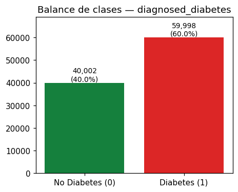
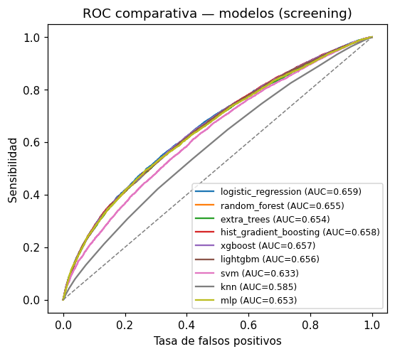
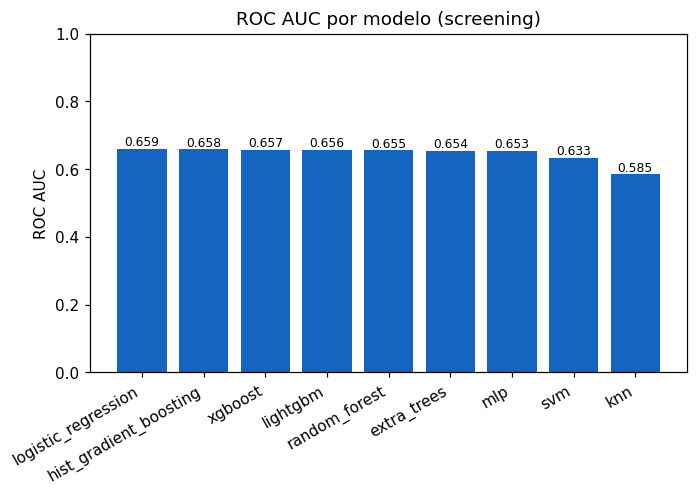
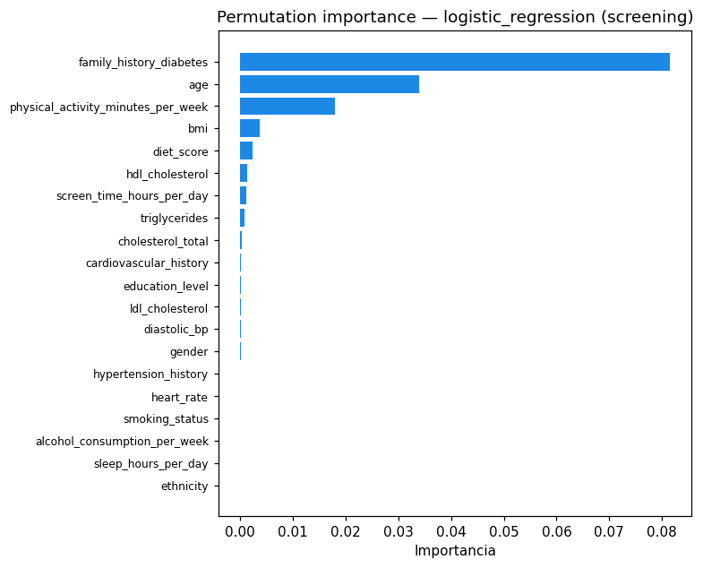
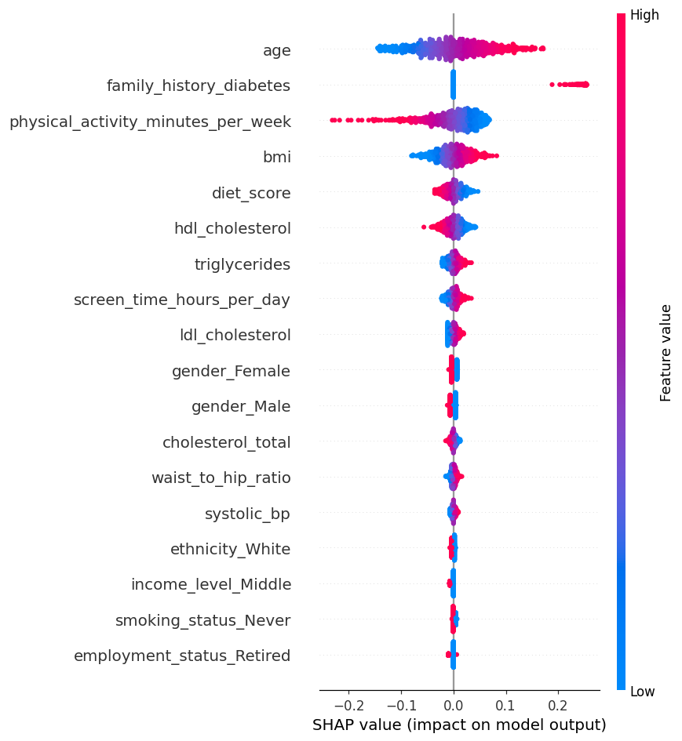

# PREDIA — Reporte Técnico de Modelos de Predicción de Diabetes

> Generado automáticamente desde los artefactos de `ml-research/` (reproducible, seed=42).

## 1. Resumen ejecutivo

- El **modelo en producción** de PREDIA es una **Regresión Logística de 11 features**
  (`Gender, AGE, Urea, Cr, HbA1c, Chol, TG, HDL, LDL, VLDL, BMI`) servida con **coeficientes hardcodeados en TypeScript**
  (`apps/web/lib/ml-predict.ts`); los `.pkl` de `apps/web/models/` **no se cargan** en runtime.
- La accuracy reportada (**0.9789**, hardcodeada en el seed y en `modelo_metadata.json`)
  **no es reproducible** sobre `diabetes_dataset.csv`: ese modelo fue entrenado con OTRO dataset (947 muestras)
  cuyas features `Urea`, `Cr`, `VLDL` **no existen** aquí.
- Hay **fuga de información (data leakage)** demostrable: `HbA1c` (criterio diagnóstico ADA) por sí sola
  alcanza acc≈0.852 / AUC≈0.9325.
- En el **marco honesto de cribado** (sin laboratorios diagnósticos), el mejor modelo es
  **logistic_regression** con ROC AUC **0.6591** y sensibilidad **0.5675**.

## 2. Dataset

- Archivo: `diabetes_dataset.csv` — **100,000 filas × 31 columnas**.
- Objetivo: `diagnosed_diabetes` — balance {'1': 59.998, '0': 40.002} (ratio 1.5).
- Calidad: **0 nulos**, **0 duplicados**.
- Top |correlación| con el objetivo: {"hba1c": 0.6794, "glucose_postprandial": 0.6298, "glucose_fasting": 0.5109, "diabetes_risk_score": 0.2773, "family_history_diabetes": 0.1979, "age": 0.1377}.

## 3. Preprocesamiento y control de fuga

| Grupo | Tratamiento |
|---|---|
| `diabetes_stage`, `diabetes_risk_score` | **Eliminadas siempre** (proxy directo del objetivo) |
| `hba1c`, `glucose_fasting`, `glucose_postprandial`, `insulin_level` | Laboratorios diagnósticos: **excluidos en *screening***, incluidos en *clinical* (con advertencia) |
| Categóricas nominales | One-Hot Encoding |
| Numéricas | StandardScaler (z-score) |
| Binarias 0/1 | Passthrough |

Split estratificado 80/20 reproducible (seed=42); preprocesamiento dentro de un `Pipeline` (sin fuga train→test).

## 4. Comparación de modelos — marco *screening* (honesto)

| model | accuracy | roc_auc | recall_sensitivity | specificity | f1 | mcc | cv_roc_auc |
| --- | --- | --- | --- | --- | --- | --- | --- |
| logistic_regression | 0.6044 | 0.6591 | 0.5675 | 0.6597 | 0.6325 | 0.2229 | 0.661 |
| hist_gradient_boosting | 0.631 | 0.6579 | 0.8391 | 0.3189 | 0.7318 | 0.1856 | 0.6591 |
| xgboost | 0.6289 | 0.6573 | 0.8317 | 0.3246 | 0.7289 | 0.1817 | 0.6587 |
| lightgbm | 0.628 | 0.6558 | 0.8387 | 0.3119 | 0.7301 | 0.1776 | 0.6574 |
| random_forest | 0.6244 | 0.6549 | 0.8848 | 0.234 | 0.7387 | 0.1576 | 0.6573 |
| extra_trees | 0.6194 | 0.6538 | 0.922 | 0.1656 | 0.7441 | 0.1356 | 0.6551 |
| mlp | 0.6244 | 0.653 | 0.7937 | 0.3704 | 0.7172 | 0.1807 | 0.6555 |
| svm | 0.6123 | 0.6328 | 0.96 | 0.0907 | 0.7482 | 0.1044 | 0.636 |
| knn | 0.6003 | 0.5845 | 0.8251 | 0.2631 | 0.7124 | 0.1061 | 0.5872 |

## 5. Marco *clinical* (con laboratorios diagnósticos)

Incluir los labs diagnósticos sube las métricas, pero **reaprende el umbral diagnóstico** (fuga parcial):

| model | accuracy | roc_auc | recall_sensitivity |
| --- | --- | --- | --- |
| xgboost | 0.9199 | 0.9444 | 0.8665 |
| random_forest | 0.9196 | 0.9417 | 0.8665 |
| logistic_regression | 0.8878 | 0.9339 | 0.8775 |

## 6. Auditoría del modelo actual — demostración de fuga (CV5, LogReg)

| feature_set | accuracy | roc_auc |
| --- | --- | --- |
| hba1c_only | 0.852 | 0.9325 |
| glucose_fasting_only | 0.7307 | 0.8082 |
| diagnostic_labs | 0.8567 | 0.9337 |
| leaky_stage_plus_score | 0.9979 | 0.9974 |
| screening_numeric_safe | 0.6163 | 0.6121 |

**Lectura:** el ~98% reportado solo es alcanzable con variables diagnósticas/fugadas; con cribado honesto
un modelo lineal queda cerca del azar (base rate 59.998%).

## 7. Modelo seleccionado e interpretabilidad

- **Seleccionado:** `logistic_regression` — marco *screening (sin laboratorios diagnósticos — honesto)*.
- Métricas test: {"accuracy": 0.6044, "balanced_accuracy": 0.6136, "precision": 0.7144, "recall_sensitivity": 0.5675, "specificity": 0.6597, "f1": 0.6325, "mcc": 0.2229, "tn": 5278, "fp": 2722, "fn": 5190, "tp": 6810, "roc_auc": 0.6591}
- Top variables (permutation importance): family_history_diabetes, age, physical_activity_minutes_per_week, bmi, diet_score, hdl_cholesterol, screen_time_hours_per_day, triglycerides

## 8. Conclusión

Las métricas del modelo actual **no son confiables** (no reproducibles, dataset/feature mismatch, fuga por HbA1c).
Para PREDIA se recomienda el modelo de **cribado honesto** seleccionado, exportado en `exports/`, con la
**migración del contrato de features** documentada en `comparisons/current_vs_new_models.md`.
